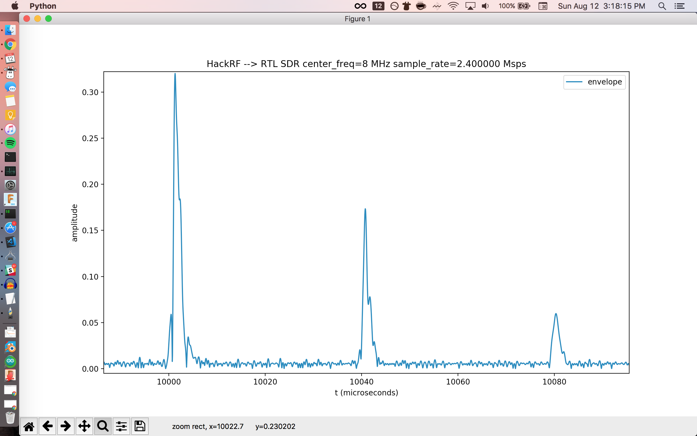

# RTL-SDR Time Domain test

William Meng K9TTL  
Aug 12, 2018

In the script `rtlsdr_timedomain.py`, I use the RTL-SDR to acquire IQ samples of a signal generated by a HackRF.
The signal is simulating an ultrasound signal, see [HackRF Ultrasound Simulator](https://github.com/wlmeng11/SimpleRick/blob/master/experiments/20180807/hackrf_ultrasound_simulator.ipynb) for details.

From the IQ samples, I generated a plot of the signal's envelope.

Here is a screenshot of the results:  

