# B-mode image generator

William Meng K9TTL  
Aug 19, 2018

This script B_mode.py generates and displays a B-mode sector scan image
from a provided .npy file.

A lot of parameters are hardcoded in the default_params dictionary,
but at least they're not hardcoded in the function itself.
So now I just need a way to specify a custom params dictionary
based on some input from the command line.
Since there are lots of parameters, it would be messy to pass easy
parameter as a command line argument.
Instead, the user could pass the filename of some JSON data that
is then parsed to fill the dictionary.

## Results  
Unless otherwise specified, depth = 32 cm.
Note that depth in this context is a bit of a misnomer, 
as it refers to the round trip distance rather than 

1. Stationary piezo, facing plastic wall.
This data was acquired in [the previous notebook](../20180818/rtlsdr_ultrasound_test.ipynb).

2. No Tx pulses, so the data is all noise.
Because the RTL-SDR gain is set to auto, the samples
still have enough amplitude to trigger the scanlines.
First usage of `rtl_to_npz` script.
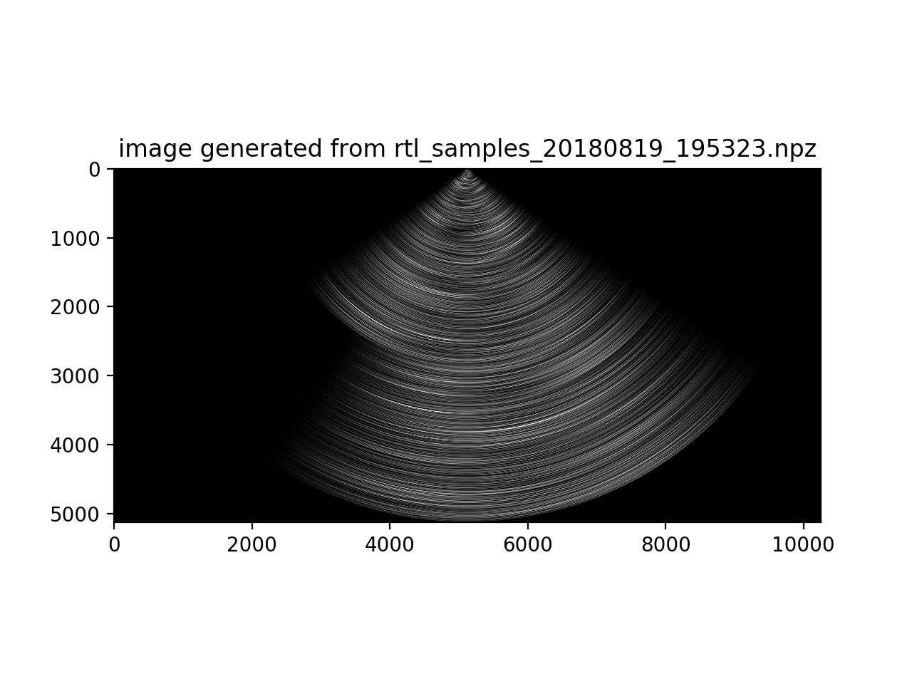

3. Not exactly sure what this means.
I was having some issues getting the firmware to send
Tx pulses only when the user button is pressed.
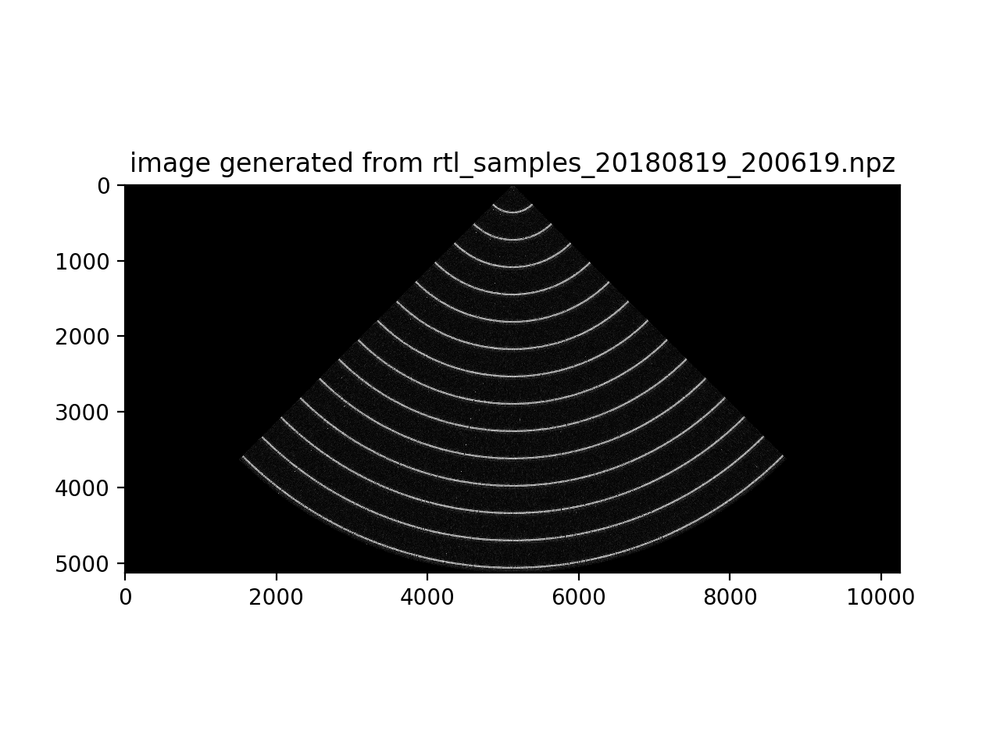

4. Similar setup as first image, but with piezo at a slightly
different angle, and this data was acquired with `rtl_to_npz` script.
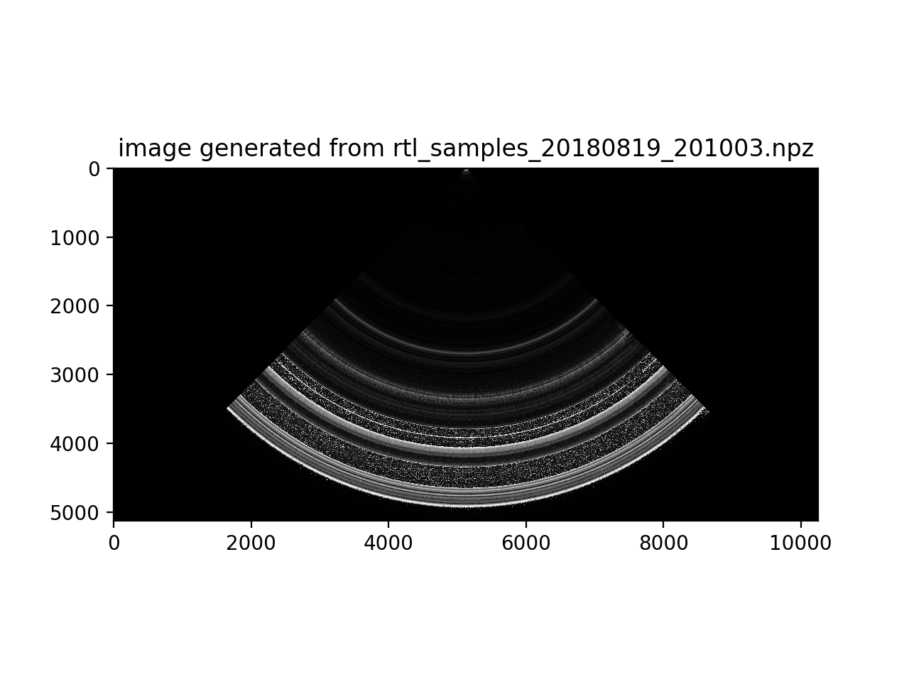

5. Motor rotates piezo in a plastic box filled with water.
Many echoes result from reflections off the walls.
Looks like some weird alien art.
Notice the symmetry because the motor changed direction midway
through the data acquisition.
I haven't yet synchronized the motor to the data acquisition process yet,
so it is simply spinning back and forth freely.

6. A single metal cylinder placed a few cm from piezo, in my sketchy anechoic chamber.
The anechoic chamber is built by taping some foam to the walls of the plastic box.
Motor rotates piezo back and forth.  
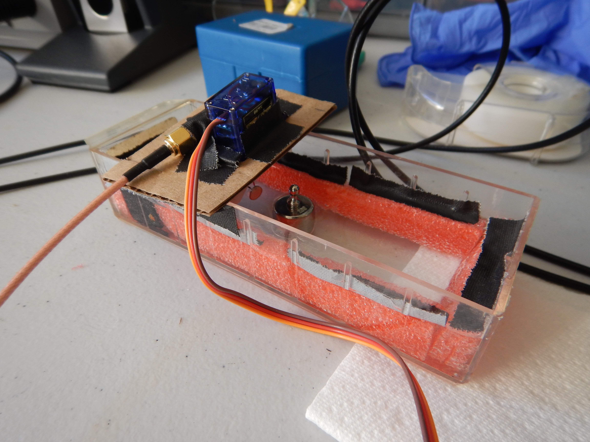  
Not sure what to make of this image.
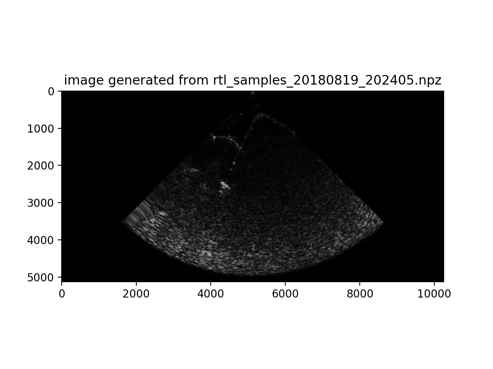
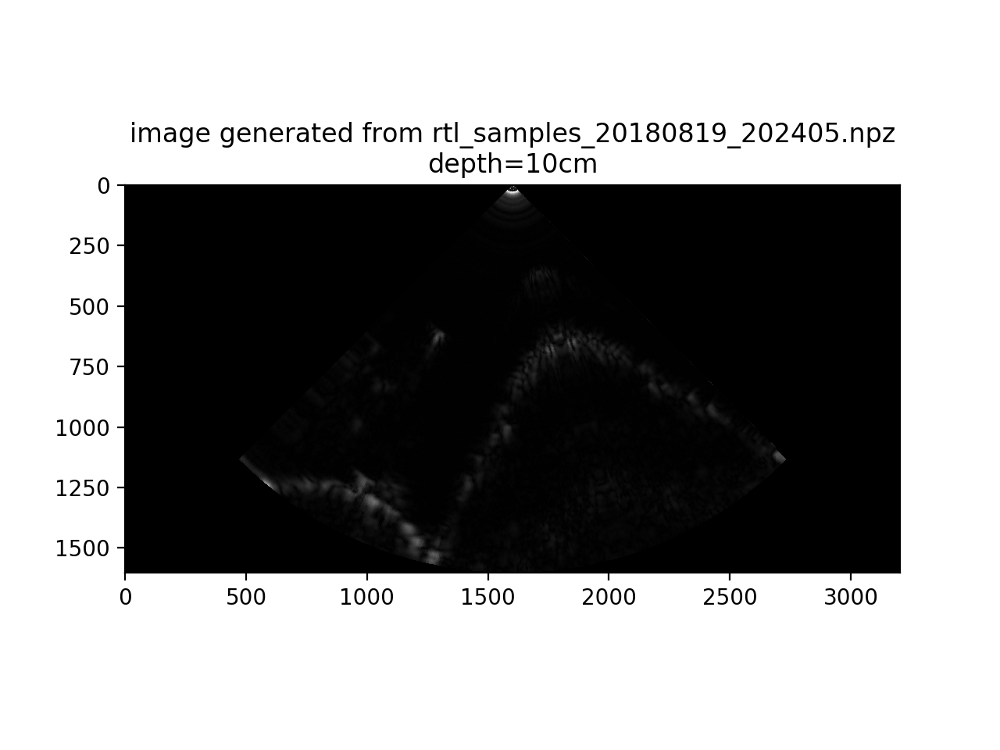

7. Same setup as above, but metal cylinder is moved to be further away from piezo.
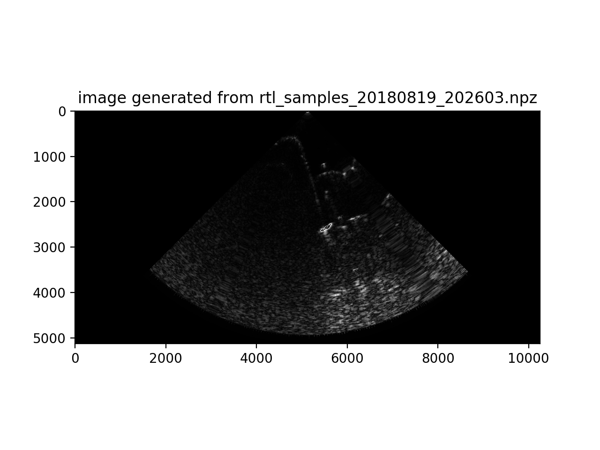

8. Dual row header pins placed in water in anechoic chamber.
Motor rotates piezo back and forth.

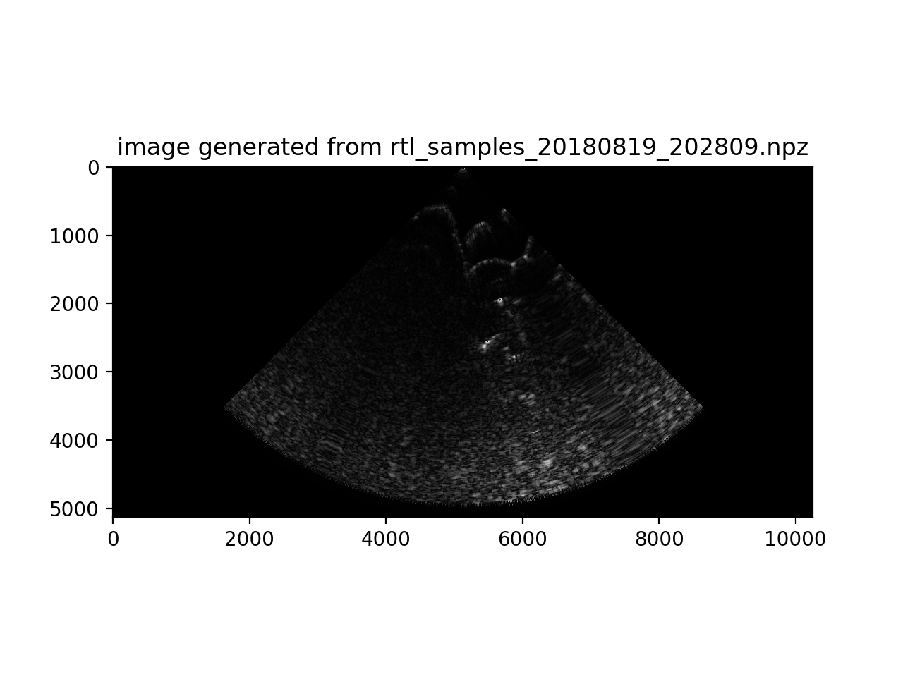
It's possible that the white streaks with black stripes in the image below represents the header pins, but I'm not totally sure.
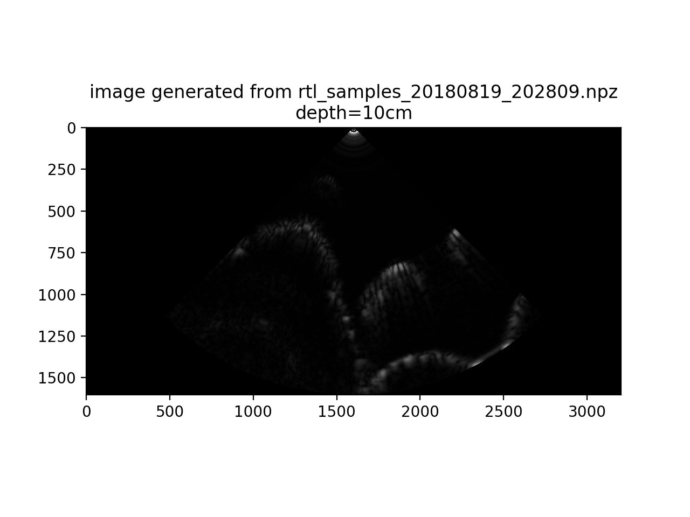

9. Single row header pins placed in water in anechoic chamber.
Motor rotates piezo back and forth.

10. Stationary piezo in anechoic chamber, but manually varying the distance of a metal cylinder from the piezo. Faint but visible, we can see the wavy curve that represents my hand moving the piezo
closer and further away from the piezo a couple times.
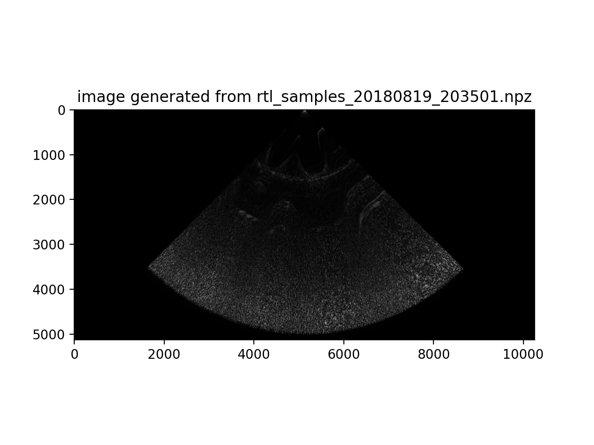
By reducing the depth parameter, we can see it more clearly.
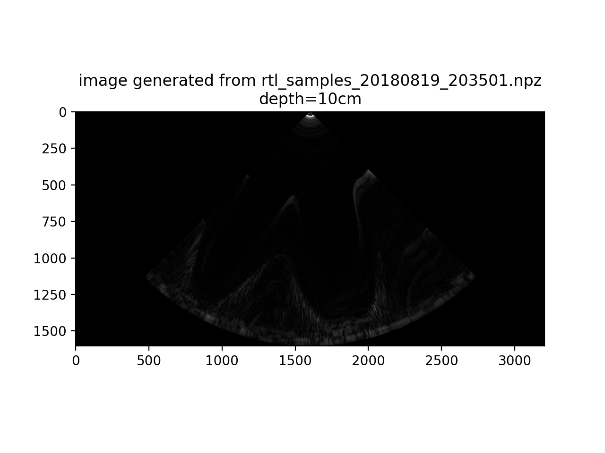

11. Two metal cylinders placed in water in anechoic chamber.
Motor turns piezo back and forth.

And there it is!
We can clearly see two white spots in the image
corresponding to the physical arrangement of the metal cylinders,
and then the mirror image as the motor changes direction.
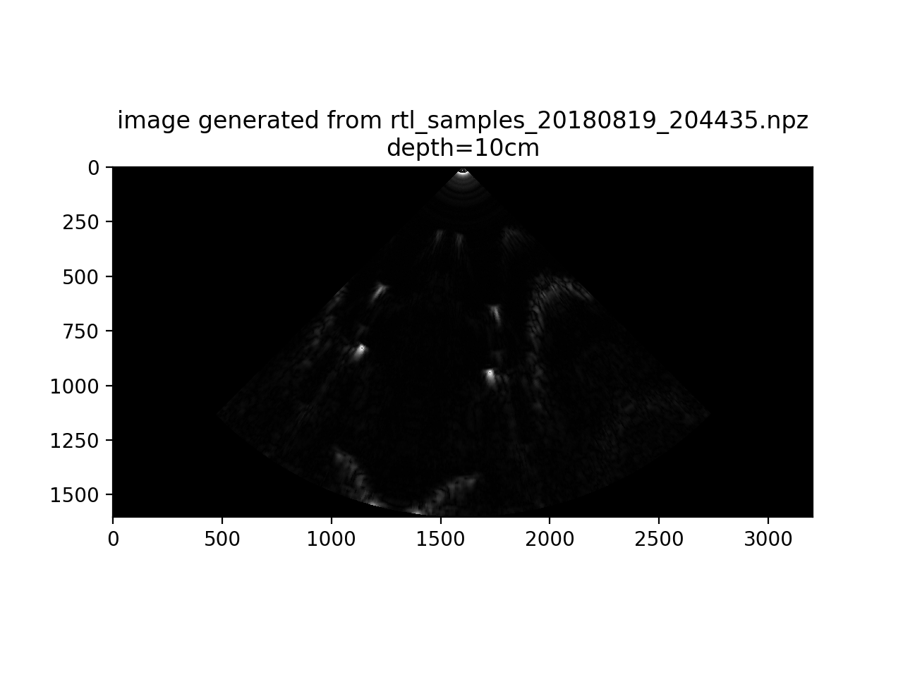
Truncated the data so we can see it more clearly within the 90º sector view.

