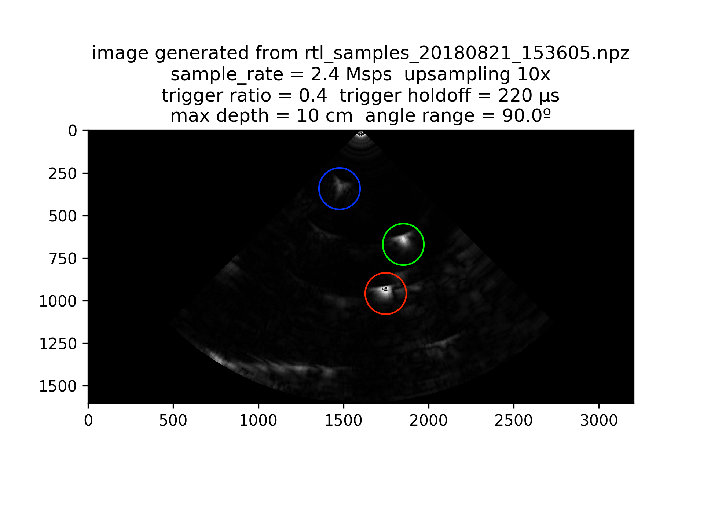
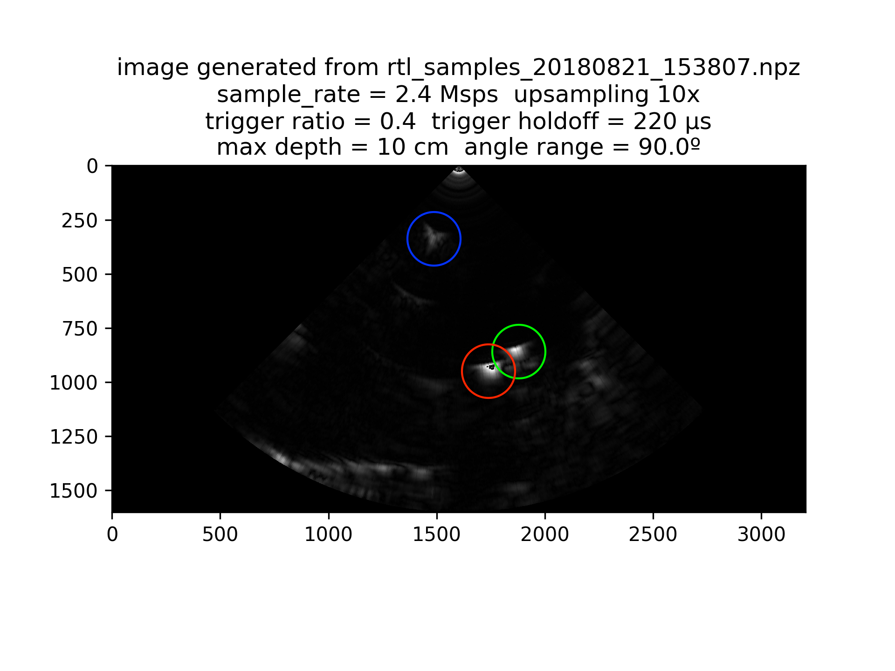
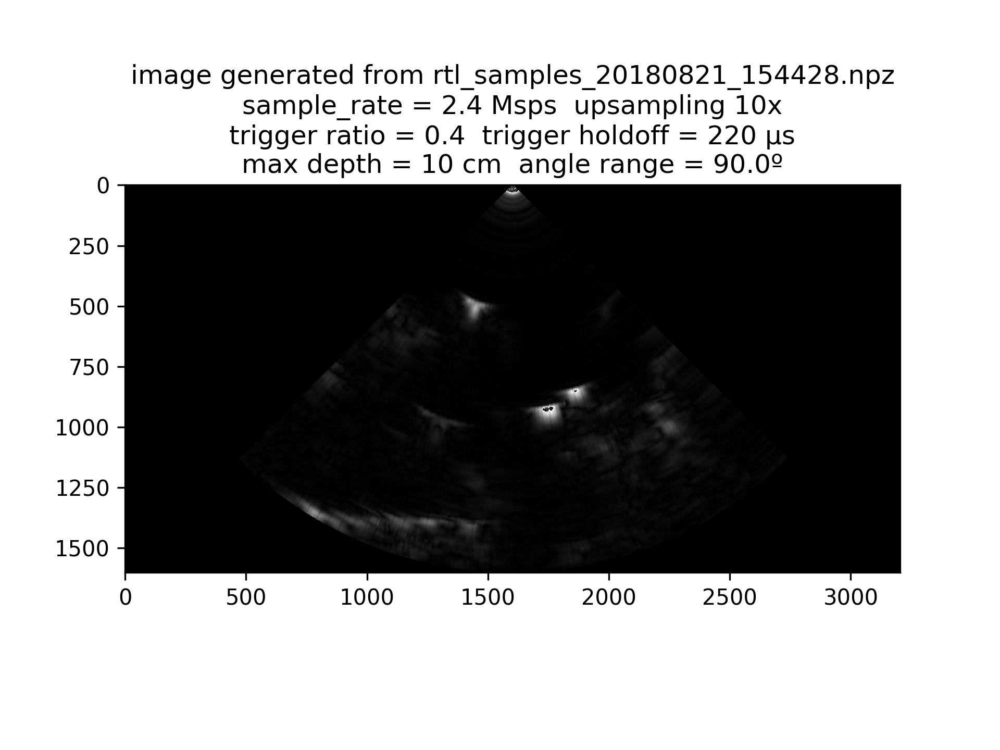
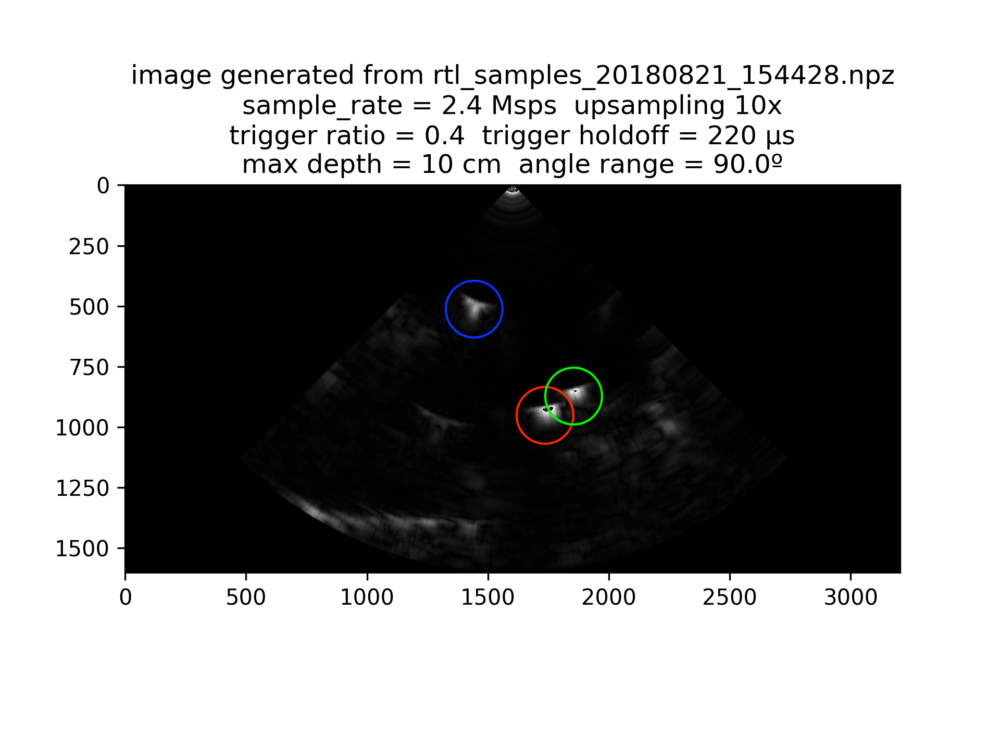
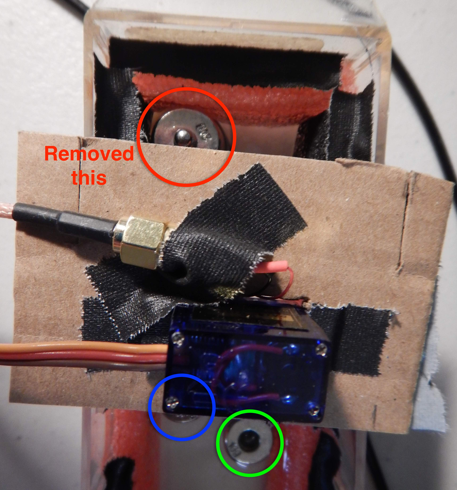
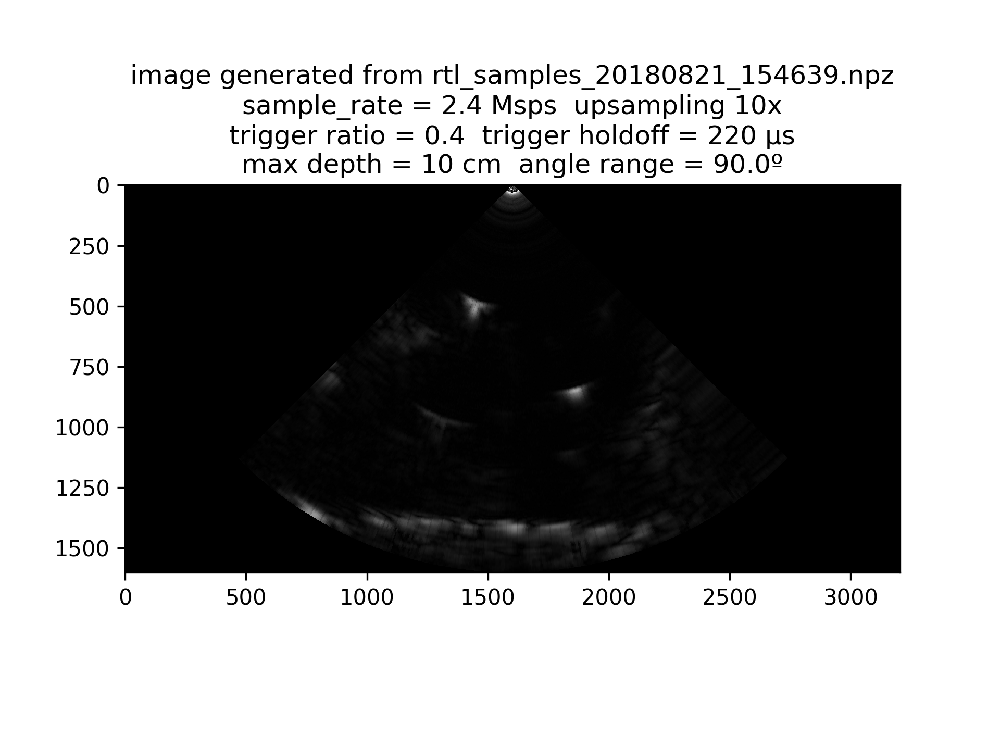
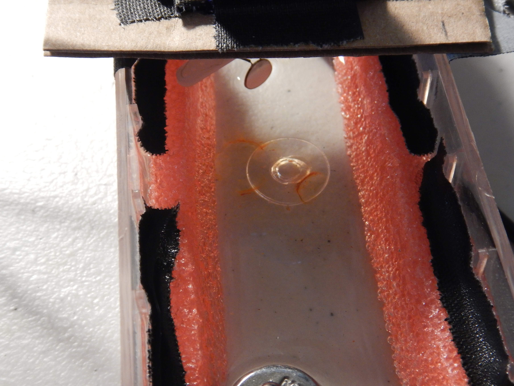
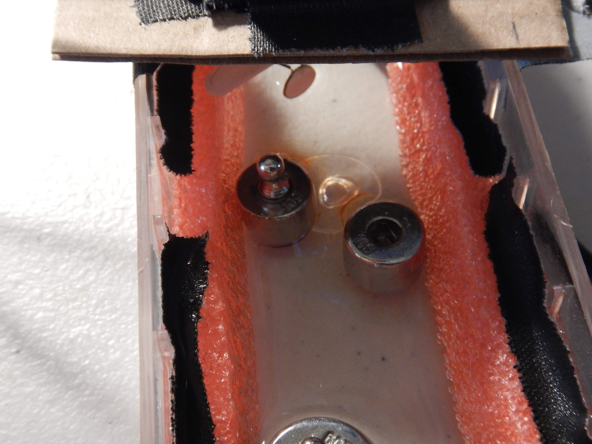
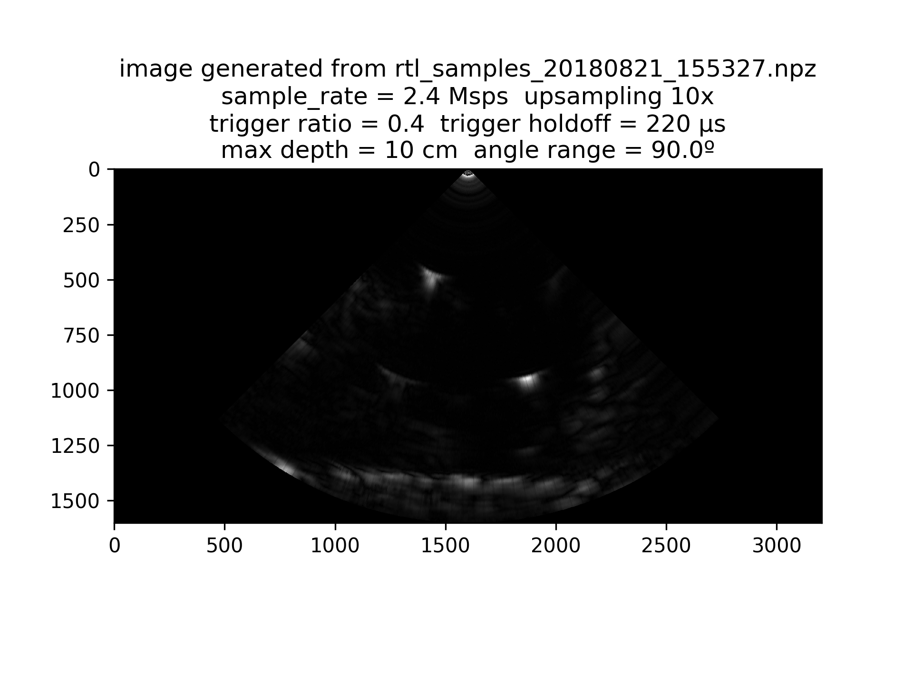

# B-mode experiments with motor control

William Meng K9TTL  
Aug 21, 2018

### Experimental Setup
As in the [previous experiment](../20190819/README.md),
I am imaging some steel weights that act as ultrasound reflectors inside a pseudo-anechoic chamber.
This time, the servo motor is controlled by the microcontroller so that I can control the initial angle, range of angles swept, and motor speed.

_Piezoelectric transducer is swept by servo motor_

_Hardware setup with [SimpleRick v1.1](https://github.com/wlmeng11/SimpleRick/), 12.5 MHz low pass filter, and RTL-SDR_

### Results

1. initial angle = 30º

I see two bright spots, but the orientation appears to be incorrect. Either the image is flipped, or another reflector is showing up in the image.
To bring the spots closer to the center of the image, I increased the initial angle.

2. initial angle = 75º

Now I see a dim spot in the top left corner, but there are still two bright spots in the lower right. One of the spots must be extraneous. Let's label each spot with a color so we can track their movements as I move the weights around.

3. I moved the right weight down a little bit.

We can see that the green spot moved down.
So the red spot is probably extraneous.

4. I moved the left weight down a little bit.

We can see that the the blue spot moved down.
So the red spot must be extraneous.

5. I remembered that I put another weight on the opposite side of the box to hold some foam in place.
Since the piezo is uncoated, the acoustic waves propogate equally from both of its faces. So echoes from objects on the other side of the piezo can also appear in the image. 
For this image, I removed that weight.

6. Let's get scientific: 
**Control trial**

7. **Trial with 2 weights**

### Summary
The ability to control the motor's speed and angle allows for reliable and repeatable ultrasound imaging.
When using a bare piezoelectric disc as the transducer, be wary of echoes from objects on both sides of the piezo.

So far, the ultrasound system can resolve objects with a resolution on the order of 1 cm.

Stuff to improve in the image processing:

* nice formatting of image parameters
* accurate labeling of scale in mm
* implement scanline triggering with efficient C++ code